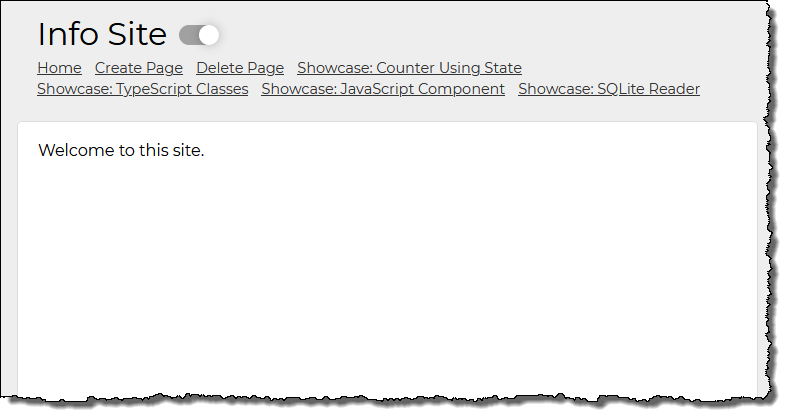

# Datapod for React

This is a framework which extends create-react-app to enables you to quickly build data-driven sites.

## Setup

- clone repository
- `npm install`
- `npm run start2`
- `npm run backend`
- you will see in your browser a site like this:

## Current Features

- You can immediately create and delete pages with the Create Page and Delete Page menu items.

- View the showcase pages to see various examples features that can be built into the site.

## Datapod Command Line Interface

- get help: `npm run dpod`
- create page: `npm run dpod -- createPage --pageTitle "Showcase Regex"`

## Datapod Concepts

### The distinction between `system` and `custom` 

- `system` = everything that is core to the Datapod framework
- `custom` = everything that is specific to a particular website which uses Datapod
- there are two areas under `src`: 
	- `system` - contains all components, classes and all other files that are necessary for the framework to run
	- `custom` - contains all components, classes, etc. for a specific website that uses Datapod as its framework
	- keep these files separate as you build your site so that in the future, you can upgrade to a new version of Datapod which will only change files in `system`
- you will also see this distinction in e.g. ItemTypes and DataTypes, some that are `system` (e.g. `users`, `pageItems`) and some that are not (e.g. `howtos`, `flashcards`, `servers`, etc.)

### Showcase Pages

Datapod is seen foremost as a tool in which everything that you need to develop is contained in the site itself, i.e. is "pod like." In this spirit, Datapod-for-React has many *Showcase Pages* each which demonstrate how to do something with Datapod-for-React or in React itself. These pages show a live example of something that works which the developer can experiment with and then study the code to see how to implement it. When Datapod code contributors work on certain aspects of the site and first need to try something out to see if it works, they will often create a *Showcase Page* to get it working, and then when it works, they will leave it there for other developers to use.

Datapod has a `live` mode and a `developer` mode. When the site is in live mode, none of these showcase pages or any other developer pages are visible or available. But when the developer switches to developer mode, all of these pages are available in the menu of the site itself.

### ItemTypes

- (todo)

### DataTypes

- (todo)

## Datapod-for-React Conventions 

### Prefer TypeScript

- to increase code security and stability, use TypeScript to create components, classes and modules instead of JavaScript

### Prefer function components

- to increase readability and testing, use React function components instead of class components

### Prefer SASS

- to increase styling flexibility, use SASS (`.scss`) instead of CSS files

### File extensions

- TypeScript components have the extension `.tsx`
- TypeScript classes, modules and scripts have the extension `.ts`
- JavaScript components have the extension `.jsx`
- JavaScript classes, modules and scripts have the extensions `.js`
